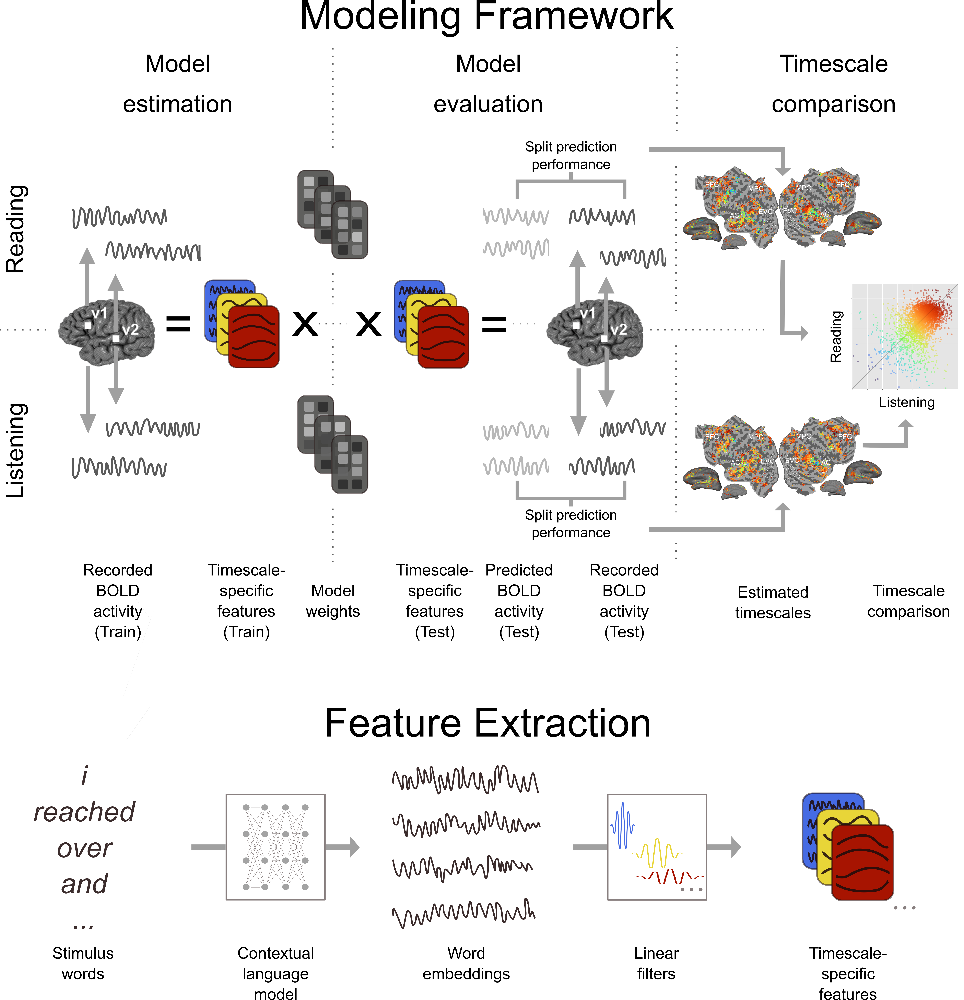

# The Cortical Representation of Language Timescales is Shared between Reading and Listening


Language comprehension involves integrating low-level sensory inputs into a hierarchy of increasingly high-level representations. Although written and spoken language contain different low-level sensory inputs (e.g., visual letterforms vs. auditory sound spectra), both modalities of language contain a hierarchy of linguistic features. Prior studies have shown that, to some extent, written and spoken language comprehension activate overlapping brain areas -- within these areas, is language integrated in the same way regardless of stimulus modality?

To investigate this question, we operationally defined different levels of the language hierarchy as *timescales*, where each timescale refers to the spectral components of a language stimulus that vary over a certain number of words. We used fMRI BOLD data that were recorded while participants read and listened to the same set of natural language narratives in each modality (Huth et al., 2016, Deniz et al., 2019), and constructed features that describe the stimulus narratives at different timescales. Voxelwise encoding models were used to determine how different language timescales are represented across the cerebral cortex, for each modality separately.

These models reveal that across temporal, parietal, and prefrontal cortices, the organization of brain representations of language timescales is largely independent of stimulus modality. Our results suggest that, after low-level sensory processing, language integration proceeds similarly regardless of stimulus modality.

## Code
This repository contains code to construct features that describe the stimulus narratives at each timescale. To construct the default timescale-specific features used for results in the main text, run the following commands:
```
cd feature_extraction
python save_features.py BERT_all
```

The stimulus features will be saved in `./outputs/timescales_BERT_all.npz`. This file will contain an array labeled `train`, which contains the train stimulus features as a dictionary of `{[timescale_name]: (num_train_trs x num_units) feature space matrix}`. This file will contain another array labeled `test`, which contains the train stimulus features as a dictionary of `{[timescale_name]: (num_test_trs x num_units) feature space matrix}`.

To instead extract timescale-specific features with a rolling input context length of 10 or 100 words, replace `BERT_all` with `BERT_10` or `BERT_100` respectively.

The BOLD data used in our study can be found [online](https://berkeley.app.box.com/v/Deniz-et-al-2019). To construct voxelwise encoding models, we recommend using [himalaya](https://gallantlab.org/himalaya/).
